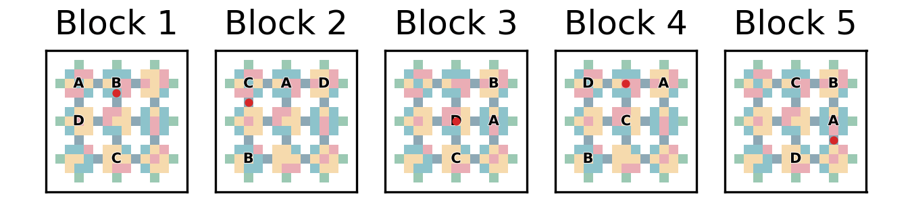

# Grounding Schemas

<p align="center">
  
</p>

This repository contains the code for the experiments and figures used in:  [Schema-based active inference supports rapid generalization of experience and frontal cortical coding of abstract structure](https://arxiv.org/abs/2601.18946) by Toon Van de Maele, Tim Verbelen, Dileep George and Giovanni Pezzulo.

## Installation

All simulations are created using Python 3.11. To install the dependencies, create a virtualenvironment of your choice (e.g. pyenv) and run the following command from the root of the project: 

```
pyenv virtualenv 3.11 grounding-schemas
pyenv activate grounding-schemas
pip install -e . 
```

## Running the simulations

The scripts for running the simulations and generating the figures of the paper can be found in the `experiments` folder. For ease of use, we aggregated run commands in a Makefile which can be executed in a shell where the virtual environment is active. 

Use the following command to train the CSCGs offline. This will train a navigation model first, and use this to train several variants of task space clone graphs on different environment settings (see the paper for details).
```
make learn_clone_graphs
```

You can then run the simulations for the large maze using the following command. This will run the experiments with on the abcd environment (default), the abcb environment (with alternation), and an environment where blocks repeat.  
```
make large_maze_experiments
```
If you want to run the same for the small maze: 
```
make small_maze_experiments
```

To generate the paper figures 
```
make figures
```

Or if you simply want to run everything:
```
make all
```


## Acknowledgments
The code for training the clone structured cognitive graphs comes from [CSCG](https://github.com/vicariousinc/naturecomm_cscg). The active inference implementation relies on [PyMDP Jax](https://github.com/infer-actively/pymdp). 

## Citation

If you find the code useful, please refer to our work using:

```
@misc{vandemaele2026schemabasedactiveinference,
      title={Schema-based active inference supports rapid generalization of experience and frontal cortical coding of abstract structure}, 
      author={Toon Van de Maele and Tim Verbelen and Dileep George and Giovanni Pezzulo},
      year={2026},
      eprint={2601.18946},
      archivePrefix={arXiv},
      primaryClass={q-bio.NC},
      url={https://arxiv.org/abs/2601.18946}, 
}
```
